# Linux Troubleshooting Journey

> Real incidents, real mistakes, real learning

I'm Jill Ravaliya, learning Linux to build a career in cloud engineering. This repository documents actual problems I encountered on my personal Ubuntu system – not from tutorials, but from genuine troubleshooting under pressure.

**What this shows**: How I diagnose issues, recover systems, and learn from breaking things.

---

## 🔴 Incident 1: The Day I Killed GNOME (My First Real Crisis)

### The Exploration

Months ago, I wasn't trying to "become a Linux expert" or anything. I was just deeply curious. I had installed Ubuntu and I was slowly trying to understand what Linux actually looks like from the inside – not just the desktop, but what's really happening underneath.

At first, I started exploring the filesystem, step by step:

- `/` – the root, where everything begins
- `/home` – my files
- `/etc` – configuration files
- `/var` – logs and temporary stuff
- `/bin`, `/sbin`, `/usr` – commands and programs

One day I reached `/proc`.

It looked... different. Not like other directories. Inside were numbers, strange files, system-looking things. At that time, I didn't fully understand what `/proc` truly was. Later I learned that `/proc` is not a real filesystem stored on disk – it's a **virtual filesystem** that represents running processes and kernel data in real time. It's a window into what the kernel sees.

But at that moment, I only had one thought:

> "Why are there so many numbers here?"

That's when I first connected `/proc` with commands like `ps` and `top`. I had learned that `ps` shows running processes and `top` shows them live with CPU and RAM usage. The numbered directories in `/proc` – like `/proc/1234` – are actually live representations of running processes, where `1234` is the PID (Process ID).

I didn't fully understand processes yet, but I knew this:

> "These commands show what's running inside my system right now."

### The Mistake

One day, out of pure curiosity, I typed:

```bash
top
```

The screen filled with moving numbers:

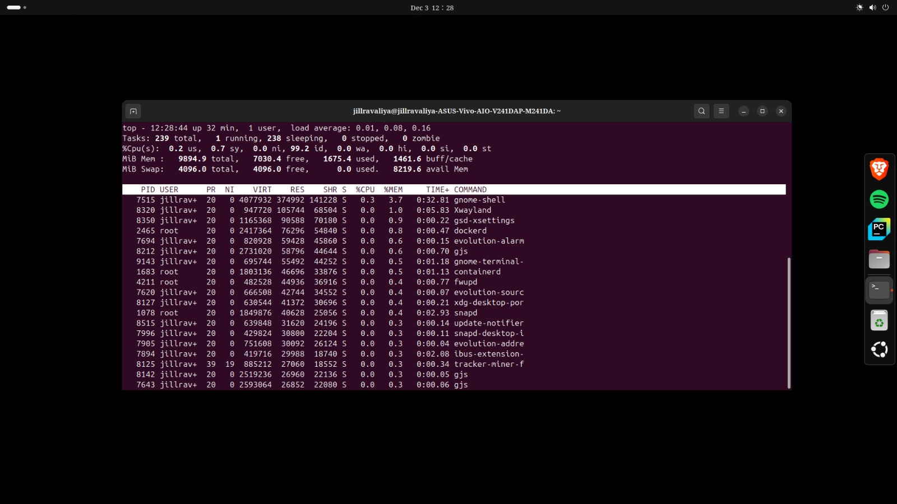
*First time running top - overwhelmed by all the processes, focusing on the one using most resources*

```
PID   USER  %CPU  %MEM  COMMAND
7515  user   0.3   3.7  gnome-shell
8320  user   0.0   1.0  Xwayland
8350  user   0.0   0.9  gsd-xsettings
```

CPU usage. Memory usage. Process names. PIDs.

At first, it felt overwhelming. But then my eyes locked onto something at the top of the list – a process with `gnome` in its name, `gnome-shell`, using noticeable RAM (3.7%) and a little CPU.

In my beginner brain, the logic was simple and very wrong:

> "Oh... this must be some heavy application eating my memory. Let's kill it and free some RAM."

I didn't think "desktop environment."  
I didn't think "session manager."  
I didn't think "critical system component."

I thought: **"Normal app. Let's kill it."**

So I noted the PID – let's say it was `7515` – and typed:

```bash
kill -9 7515
```

### The Crash

The moment I pressed Enter –

**The desktop disappeared.**

No animations.  
No error popup.  
No warning message.

Just... **black.**

For one second I thought maybe the screen just blinked.

But then:
- The mouse cursor didn't move
- Keyboard shortcuts didn't work
- The desktop never came back

I was staring at a **black screen with a blinking cursor** asking for login.

That was the first time in my life I felt real fear from a computer.

My heart started beating fast. I genuinely thought:

> "Okay. I've broken Linux. I finally did it."

There was no browser.  
No YouTube.  
No Stack Overflow.

Only a text screen.

At that time, I didn't even know the word **"TTY"** (TeleTYpewriter – a text-based virtual console). I just knew I was in some raw terminal that felt like the basement of the operating system.

### The Struggle

I logged in at that text prompt.

I had no clear plan.  
I didn't know exactly what I had killed.  
I didn't even know what GNOME truly was.

But one thing I remembered: during my filesystem exploration, I had seen directories like `/etc/systemd/` and commands like `systemctl`. I knew that **systemd** manages services.

So my instinct was:

> "If something broke, maybe I can restart it using systemd."

I started trying commands, blindly:

```bash
systemctl status
```

This showed me a tree of all services. I saw things like:

```
● graphical.target - Graphical Interface
     Loaded: loaded
     Active: inactive (dead)
```

So the graphical target was inactive. That made sense – no GUI.

Then I tried:

```bash
systemctl restart gdm
```

**Some error appeared.** I don't remember exactly what, but it didn't work.

I tried:

```bash
systemctl restart graphical.target
```

Still nothing.

Then I did the simplest thing:

```bash
reboot
```

The system rebooted. I waited.

**Still black screen. No GUI.**

My heart sank again. I tried different commands. Different systemd targets. Different services.

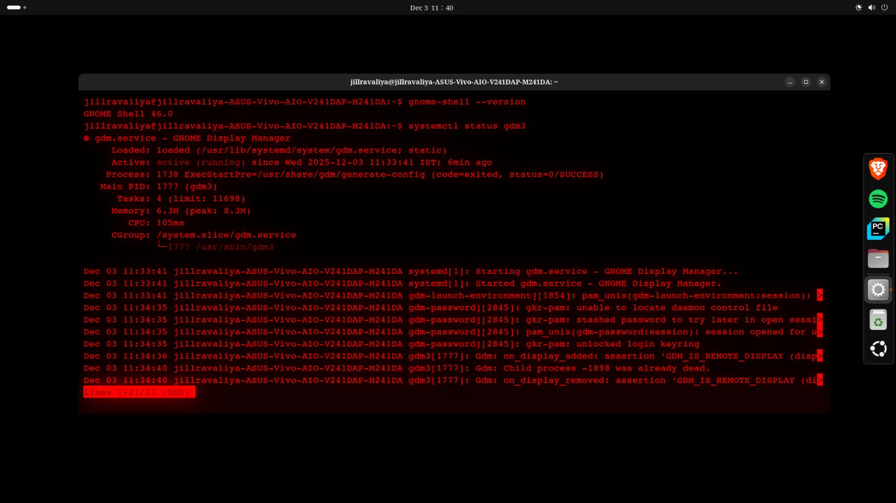
*Desperately trying systemctl commands to bring back the GUI - checking gdm3 status*

```bash
systemctl restart gdm3
systemctl isolate graphical.target
```

Rebooted again.  
Still nothing.

**I was in pure survival mode** – trial and error, fear and curiosity mixed together. At no point was I following a tutorial. I was just trying to survive.

Then – after one of the reboots, after trying multiple different systemd commands – **the desktop finally came back.**

Login screen appeared.  
I logged in carefully, expecting something to be broken.

But... everything was normal. The desktop was back. All my files were there. Nothing was lost.

That moment felt unreal. I didn't feel like I had "learned Linux."

**I felt like I had escaped from a cave.**

### What I Learned (Then)

That day I realized something deep, even if I couldn't explain it in technical words yet:

> "Sometimes breaking things teaches you more in 10 minutes than reading for 10 days."

What I understand now:
- **gnome-shell** is the compositor and window manager – it renders everything you see
- Killing it with `kill -9` (SIGKILL) removes the entire graphical layer
- The system keeps running underneath, but there's nothing to draw the desktop
- TTY (text terminals) exist independently of the GUI
- systemd manages services and can restart them
- Multiple reboots eventually brought services back in correct order

**Time to fix**: ~30-45 minutes (mostly panic and trial-and-error)  
**System**: Ubuntu 22.04 LTS (estimated)  
**Difficulty**: High (first-timer with no recovery knowledge)

---

## 🟠 Incident 2: The Boot That Never Came (Unexpected Interruption)

### When Everything Changed

Then suddenly, during one of my reboots while experimenting with killing GNOME processes, something completely different happened.

Instead of the login screen, I saw **text scrolling on a black screen**:

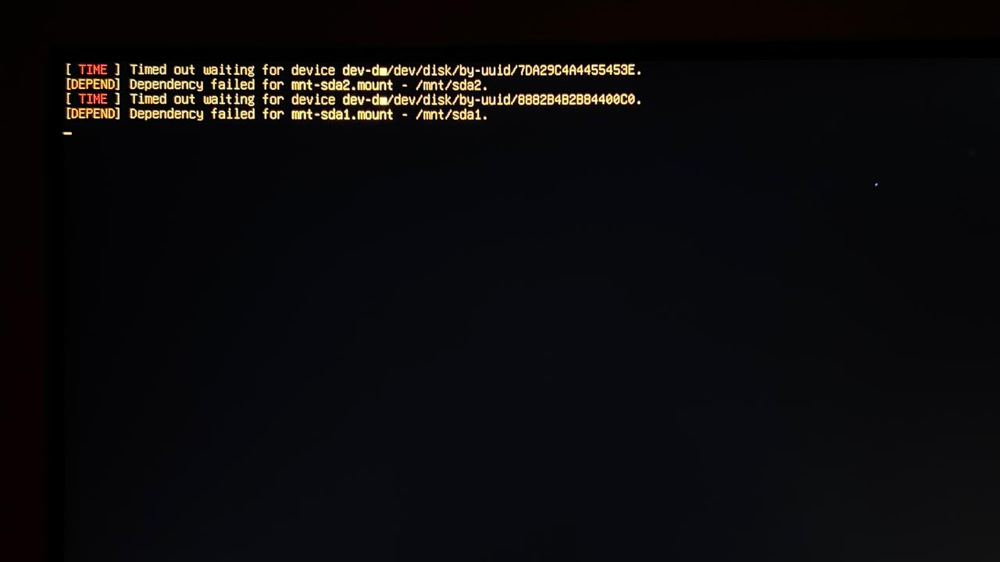
*Boot sequence hanging - systemd waiting for non-existent disk UUIDs*

```
[  OK  ] Started User Manager for UID 1000.
[  OK  ] Reached target Multi-User System.
[ TIME ] Timed out waiting for device /dev/disk/by-uuid/7DA29C4A4455453E.
[DEPEND] Dependency failed for /mnt/sda2.
[ TIME ] Timed out waiting for device /dev/disk/by-uuid/8882B4B2B844000C.
[DEPEND] Dependency failed for /mnt/sda1.
[  ***] A start job is running for /mnt/sda2 (47s / no limit)
```

Then the system just froze with a blinking underscore:

```
_
```

Now I knew instantly: **This wasn't GNOME. This wasn't a session problem. This was boot.**

The system wasn't reaching the desktop at all. This was happening **before** the GUI even had a chance to start. The boot sequence was stuck waiting for something.

I had accidentally stumbled into a completely different problem while experimenting with GUI crashes.

### The Diagnosis

The error messages were clear:

- `Timed out waiting for device /dev/disk/by-uuid/...` – systemd was trying to mount a disk
- `Dependency failed for /mnt/sda2` – the mount operation failed
- The UUID didn't exist

After waiting and seeing no progress, the system eventually dropped me into **emergency mode**:

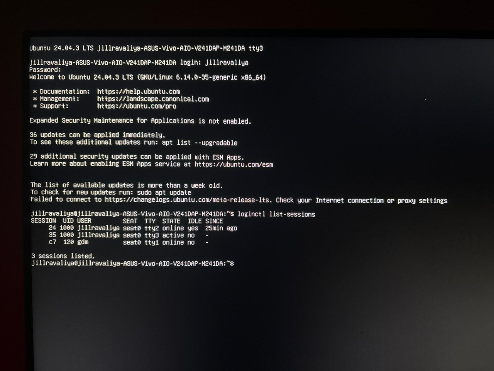
*Dropped into TTY3 after boot failure - emergency mode access*

```
You are in emergency mode. After logging in, type "journalctl -xb" to view
system logs, "systemctl reboot" to reboot, "systemctl default" or "exit"
to boot into default mode.
Give root password for maintenance
(or press Control-D to continue):
```

I entered the root password.

I knew exactly where to look. Boot-related mount problems live in one place:

```bash
nano /etc/fstab
```

When I opened it, I saw this at the bottom:

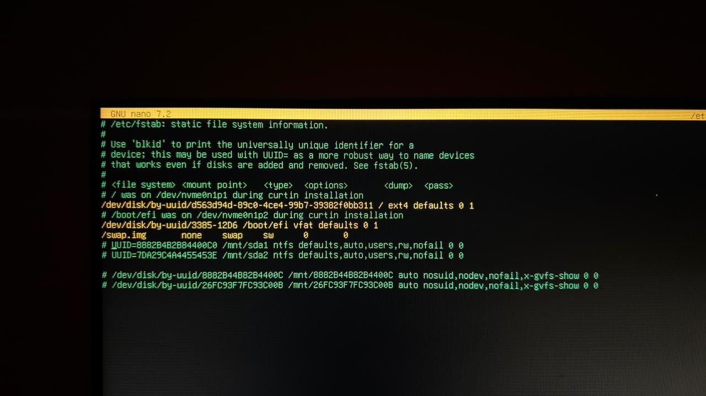
*The problematic /etc/fstab with old external HDD mount entries*

```
# /etc/fstab: static file system information.
UUID=abc123...  /                    ext4  errors=remount-ro  0  1
UUID=def456...  /boot/efi            vfat  umask=0077         0  1
UUID=8B82B4B2B844000C  /mnt/sda1    ntfs  defaults,auto,users,rw,nofail  0  0
UUID=7DA29C4A4455453E  /mnt/sda2    ntfs  defaults,auto,users,rw,nofail  0  0
```

Those last two lines – old mount entries for my **1TB external HDD** that was no longer connected. The UUIDs were from partitions that either got reformatted or were on a drive that's gone.

So at boot, systemd tried to mount those UUIDs. When it couldn't find them, it waited (hence "Timed out...") and eventually gave up, dropping me into emergency mode.

### The Fix

I deleted those last two lines.

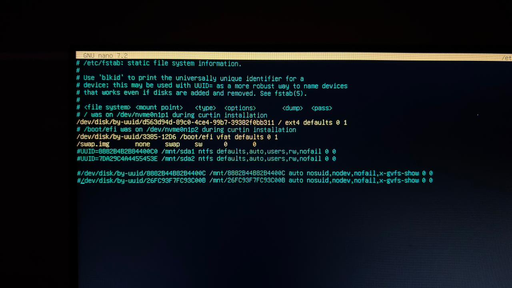
*Fixed /etc/fstab with problematic UUID entries commented out*

Then I did something important – I **tested** the fstab without rebooting:

```bash
mount -a
```

No errors appeared. Good.

Then:

```bash
reboot
```

The system rebooted. No timeout messages. No dependency failures.

The desktop came back normally.

### What I Understood

At that exact moment, I understood something very clearly:

> "Earlier, I thought I was playing with the GUI. But here, I had touched the boot chain itself."

This was deeper than GNOME. This was **systemd's mount system** – the part of the boot sequence that happens before the GUI even exists.

**Time to fix**: ~10 minutes  
**System**: Ubuntu 24.04 LTS  
**Difficulty**: Medium (scary at first, but straightforward once I knew where to look)

---

## 🟢 Incident 3: The Desktop That Wouldn't Die (Today's Experiment)

### The Return

Weeks passed.

Today, that memory came back to me.

I was again inside Ubuntu – but this time **Ubuntu 24.04** (back then it was 22.04). Again playing with the terminal. And suddenly I thought:

> "Let me try that again. Let me crash the GUI again – but this time intentionally."

This time, I was more conscious. I knew about `top`. I knew about `ps`. I knew about PIDs. I wasn't just blindly typing anymore. I understood that processes have states, signals, and relationships. I knew that `kill -9` is SIGKILL – the nuclear option.

### The Experiment Begins

So I opened:

```bash
top
```

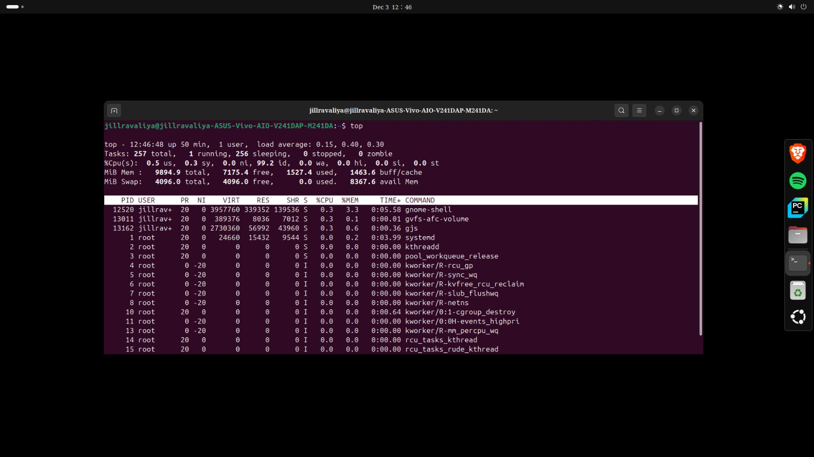
*Live system monitoring - gnome-shell at the top consuming resources*

Again, I saw all the running processes live. CPU, RAM, everything. And again, near the top, I saw processes related to GNOME taking the most resources:

```
PID   USER  %CPU  %MEM  COMMAND
12520 user   0.3   3.3  gnome-shell
13011 user   0.3   0.1  gvfs-afc-volume
13162 user   0.3   0.6  gjs
```

This time I knew the names:

- **gnome-shell** - The compositor and UI shell
- **mutter** - The window manager backend
- **gnome-session-binary** - The session manager
- **Xwayland** - The compatibility layer for X11 apps

I picked `gnome-shell`. I copied the PID – `12520`.

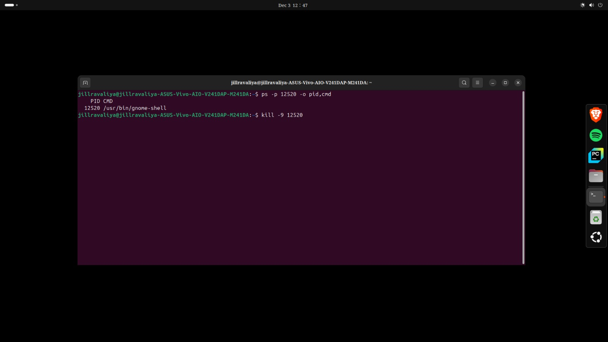
*Executing kill -9 12520 to terminate gnome-shell*

I typed:

```bash
kill -9 12520
```

The screen **blinked** for a second.

Then... **the login screen appeared.**

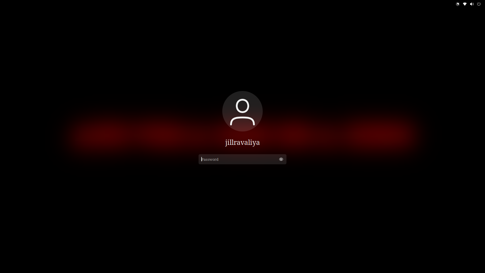
*GNOME Display Manager automatically restarted - controlled recovery instead of crash*

Not a black dead screen.  
Not a frozen system.

Just the normal login screen, as if I had logged out intentionally.

I logged in again.  
Desktop came back. Everything normal.

I felt confused.

> "Wait... so this time it didn't really crash?"

### Systematic Testing

I thought maybe I picked the wrong process, or maybe I needed to kill multiple things. So I went back:

```bash
top
```

Picked another GNOME-related PID – this time `gdm3`:

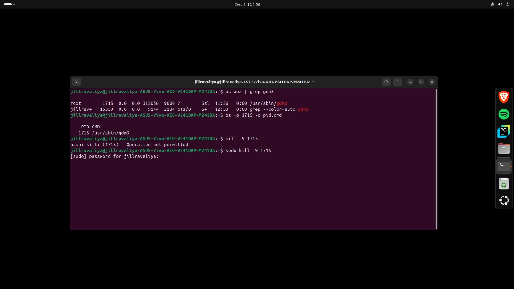
*Trying to kill the display manager - required sudo privileges*

```bash
kill -9 1715
bash: kill: (1715) - Operation not permitted
sudo kill -9 1715
```

Again: **1-second freeze → back to login screen.**

I tried again with `gnome-session-binary`:

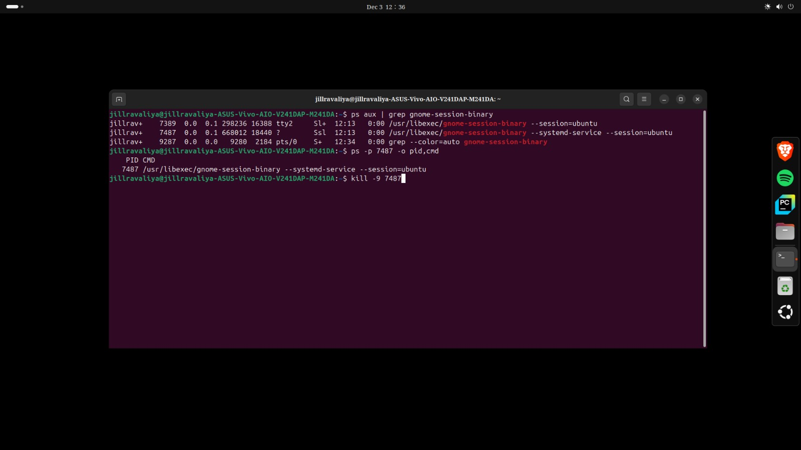
*Multiple GNOME session processes shown - attempting to kill PID 7487*

```bash
kill -9 7487
```

And again with `Xwayland`:

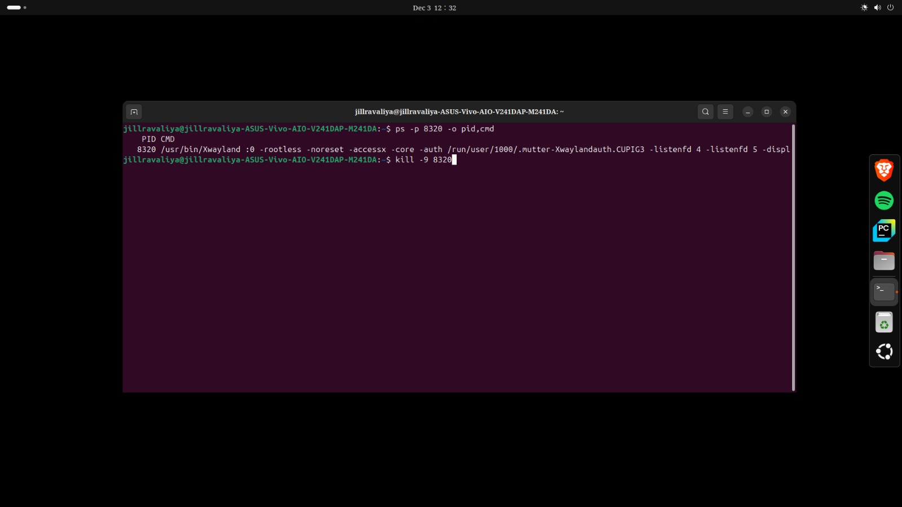
*Terminating Xwayland (PID 8320) - X11 compatibility layer*

```bash
kill -9 8320
```

And again with `mutter`:

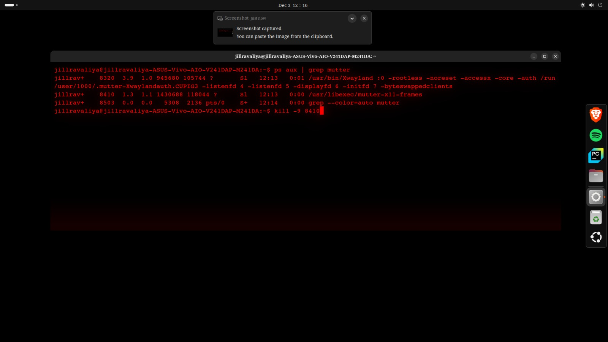
*Killing the window manager backend (PID 8410)*

```bash
kill -9 8410
```

And multiple more attempts:

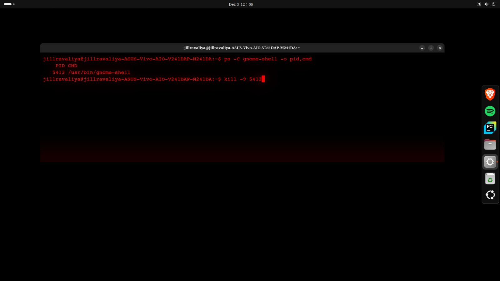
*Systematic testing - killing gnome-shell PID 5413*

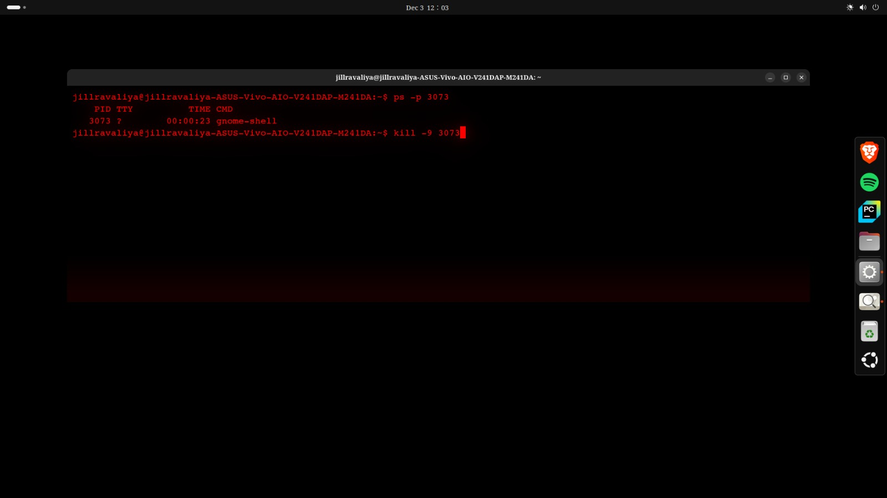
*Another attempt from TTY - PID 3073*

**Every single time, the same pattern:**

**Brief flicker → login screen → normal system.**

The desktop kept coming back. It refused to stay dead.

No matter what I killed, Ubuntu just refused to fully die.

### The Discovery

That's when it finally clicked.

Months ago, when I first crashed the GUI, I was likely on **Ubuntu 22.04** (or possibly even 20.04).

Today, I'm on **Ubuntu 24.04**.

**The system has fundamentally changed between these versions.**

I checked the GDM service configuration:


*systemctl status gdm3 showing active service with automatic restart capability*

```bash
systemctl status gdm3
```

Output showed:

```
● gdm.service - GNOME Display Manager
     Loaded: loaded (/usr/lib/systemd/system/gdm.service; static)
     Active: active (running) since Wed 2025-12-03 11:33:41 IST; 6min ago
```

And when I checked the service file itself:

```bash
systemctl cat gdm3
```

I would see (typical configuration):

```
[Unit]
Description=GNOME Display Manager
...

[Service]
Type=notify
ExecStart=/usr/sbin/gdm3
Restart=always
RestartSec=1s
...
```

That `Restart=always` line is the key. It tells systemd: **"If this service dies for any reason, restart it automatically after 1 second."**

So even when I manually stopped GDM3 with `systemctl stop gdm3`, systemd saw it stop and thought: "It crashed, better restart it" – and brought it back.

Similarly, `gnome-session` now has built-in monitoring. GNOME runs as **systemd user services** that are actively supervised. If `gnome-shell` crashes, `gnome-session` detects it and relaunches it automatically.

### The Evolution

**Old behavior (Ubuntu 22.04)**:
- `gnome-shell` ran as a regular process
- If you killed it, it stayed dead
- No automatic respawn
- You had to manually restart GDM or reboot

**New behavior (Ubuntu 24.04)**:
- **systemd user services** monitor GNOME components
- **Auto-restart policies** configured in service files
- **gnome-session** actively monitors its child processes
- **Wayland** has better process isolation and recovery

So what felt like a "system crash" in Ubuntu 22.04 has now become a **controlled session restart** in Ubuntu 24.04.

The evolution is clear:

**Old Linux**: User must know how to fix crashes  
**Modern Linux**: System fixes itself automatically

This is exactly how production infrastructure works too – auto-healing is no longer optional. It's the default.

**Time spent**: ~20-30 minutes of systematic experimentation  
**System**: Ubuntu 24.04 LTS  
**Result**: Couldn't recreate the permanent crash from Incident 1

---

## 🎯 What These Three Incidents Taught Me

### The Complete Journey

Looking back at this entire journey:

1. **Months ago**: Accidentally killed GNOME → black screen panic → struggled with recovery → multiple reboots → finally restored
2. **Today**: Tried to recreate that crash → everything auto-recovered → couldn't break it
3. **Today** (during experiments): Unexpected boot failure from old fstab entries → emergency mode → quick fix
4. **Today** (after boot fix): Continued GUI experiments → confirmed modern auto-healing

At no point was I following a tutorial.  
At no point was I trying to build a "project."

I was just asking one question again and again:

> "What happens if I do this?"

And Linux answered every time – sometimes gently with a login screen, sometimes brutally with a black screen and emergency mode.

### Technical Skills Demonstrated

**Process Management**
- Understanding PIDs and process hierarchy
- Process states and signals (SIGTERM vs SIGKILL)
- Using `ps`, `top`, `kill`, `killall`
- The `/proc` filesystem as a window into running processes

**systemd Service Management**
- Service control (`systemctl start/stop/restart/status`)
- Service configuration files and restart policies
- Understanding targets (graphical.target)
- User services vs system services
- Auto-restart mechanisms (`Restart=always`)

**Boot Process & Recovery**
- GRUB → Kernel → systemd boot sequence
- Boot stages and dependencies
- Emergency mode access and usage
- Reading boot logs with `journalctl -xb`
- Understanding why boot can fail

**Filesystem & Mounts**
- `/etc/fstab` syntax, purpose, and critical role in boot
- UUID-based disk identification vs device names
- Using `mount -a` to test configurations safely
- Mount dependencies in systemd boot process
- How disconnected drives can break boot

**Desktop Environment Architecture**
- Display managers (GDM) and their role
- Compositors and window managers (gnome-shell, mutter)
- Session managers (gnome-session-binary)
- Wayland vs X11 differences
- Process supervision and auto-recovery

**Recovery Techniques**
- TTY navigation (Ctrl+Alt+F1-F6)
- Emergency mode troubleshooting workflow
- Service restoration methods
- System recovery without data loss
- Testing changes before committing (mount -a before reboot)

**System Evolution Understanding**
- Version differences (Ubuntu 22.04 vs 24.04)
- Auto-healing mechanisms in modern systems
- Service monitoring and automatic recovery
- Modern resilience patterns matching production infrastructure

### Troubleshooting Methodology I Developed

1. **Stay calm** - Panic wastes time and clouds judgment
2. **Identify the layer** - Is this GUI, boot, network, or something else?
3. **Check logs** - `journalctl`, `dmesg`, service status give clues
4. **Test safely** - Validate changes before committing (like `mount -a`)
5. **Document** - Record what worked for next time
6. **Understand, don't memorize** - Know WHY it broke, not just HOW to fix

---

## 📋 Commands I Now Know

```bash
# Process monitoring and control
top                          # Real-time process viewer with CPU/memory
ps aux | grep <process>      # Find specific processes
kill -9 <PID>               # Force kill process (SIGKILL - nuclear option)
killall <process-name>       # Kill all instances by name
pgrep <process-name>         # Find PID by process name

# systemd service management
systemctl status <service>   # Check service status and recent logs
systemctl restart <service>  # Restart a service
systemctl stop <service>     # Stop a service
systemctl start <service>    # Start a service
systemctl cat <service>      # View service configuration file
systemctl show <service> -p Restart   # Check restart policy
systemctl isolate graphical.target    # Switch to graphical mode
systemctl --user list-units  # List user services
loginctl list-sessions       # Show active login sessions

# Boot and recovery
journalctl -xb              # View boot logs with explanations
mount -a                    # Test fstab without reboot (CRITICAL)
nano /etc/fstab            # Edit filesystem table
blkid                      # Show disk UUIDs and filesystem types
systemctl default          # Exit emergency mode to normal boot

# System information
echo $XDG_SESSION_TYPE     # Check if using Wayland or X11
tty                        # Show current TTY number
uname -r                   # Show kernel version
lsb_release -a             # Show Ubuntu version
gnome-shell --version      # Show GNOME Shell version
```

---

## ⚠️ What I Cannot Yet Do (Honest Gaps)

Being honest about what I don't know yet:

- ❌ **No real cloud troubleshooting** - This is desktop Linux on my personal system, not production AWS/Azure/GCP infrastructure
- ❌ **No automation scripts** - Haven't written bash scripts for system administration tasks yet
- ❌ **No Infrastructure as Code** - No hands-on experience with Terraform, CloudFormation, or Ansible
- ❌ **No monitoring stack** - Haven't set up Prometheus, Grafana, ELK, or other monitoring tools
- ❌ **No CI/CD pipelines** - No Jenkins, GitLab CI, GitHub Actions, or deployment automation experience
- ❌ **No containerization at scale** - Limited Docker knowledge, no Kubernetes or container orchestration
- ❌ **No configuration management** - No Puppet, Chef, or SaltStack experience
- ❌ **No production incidents** - Haven't troubleshooted real user-facing outages or scaled systems

---

## 🚀 What I'm Learning Next (Roadmap)

**Short-term (Next 2-3 months)**:
1. AWS EC2 troubleshooting using serial console and EBS volume recovery
2. Docker container debugging, logging, and basic networking
3. Basic bash scripting for system automation and health checks
4. Terraform fundamentals for Infrastructure as Code
5. Cloud-init and user-data for automated instance configuration

**Goal**: Translate these desktop troubleshooting skills to real cloud infrastructure work.

---

## 🔗 Cloud Connection (Conceptual Mapping Only)

While I haven't done cloud troubleshooting yet, I can see how my desktop experiences map conceptually to cloud scenarios:

| My Desktop Experience | Cloud Infrastructure Equivalent |
|-----------------------|--------------------------------|
| Emergency mode (root shell) | AWS EC2 Serial Console for unresponsive instances |
| `/etc/fstab` mount failures | EBS volume attachment errors or wrong device names |
| systemd service restarts | Auto Scaling Group health checks and replacements |
| `gnome-shell` auto-recovery | Kubernetes pod restart policies and liveness probes |
| TTY access when GUI fails | AWS Systems Manager Session Manager for terminal access |
| Boot process debugging | cloud-init troubleshooting and user-data script failures |
| Testing with `mount -a` | Validating Terraform plans before applying |
| Multiple reboot attempts | Instance stop/start cycles to recover from bad state |

**Important disclaimer**: This is conceptual understanding based on research, not hands-on cloud experience yet. I'm actively building toward these skills.

---

## 📬 Connect With Me

I'm actively learning and seeking opportunities in Linux administration and cloud engineering.

**Email**: jillahir9999@gmail.com  
**GitHub**: [github.com/jillravaliya](https://github.com/jillravaliya)  
**LinkedIn**: [linkedin.com/in/jill-ravaliya-684a98264](https://linkedin.com/in/jill-ravaliya-684a98264)

**Looking for**:
- Junior Linux Administrator roles
- Entry-level Cloud Engineer positions (trainee/intern level)
- Linux Support Engineer roles
- Infrastructure internships
- DevOps trainee positions

---

## 📁 Repository Structure

```
linux-troubleshooting-journey/
├── README.md (this file)
├── screenshots/
│   ├── incident-02-boot-failure/
│   │   ├── 01-timeout-errors.png
│   │   ├── 02-tty-emergency-login.png
│   │   ├── 03-broken-fstab.png
│   │   └── 04-fixed-fstab.png
│   └── incident-03-auto-recovery/
│       ├── 01-top-gnome-processes.png
│       ├── 02-kill-gnome-shell.png
│       ├── 03-login-screen-recovery.png
│       ├── 04-kill-gdm3-attempt.png
│       ├── 05-kill-gnome-session.png
│       ├── 06-kill-xwayland.png
│       ├── 07-kill-mutter.png
│       ├── 08-kill-various-processes.png
│       ├── 09-tty-kill-attempt.png
│       └── 10-systemctl-status-gdm3.png
├── incidents/
│   ├── 01-killed-gnome-first-time/
│   │   ├── detailed-story.md
│   │   ├── what-i-learned.md
│   │   └── recovery-steps.md
│   ├── 02-fstab-boot-failure/
│   │   ├── detailed-story.md
│   │   ├── broken-fstab-example.txt
│   │   ├── fixed-fstab-example.txt
│   │   └── emergency-mode-guide.md
│   └── 03-gui-resilience-ubuntu-2404/
│       ├── detailed-story.md
│       ├── systemd-auto-restart-analysis.md
│       └── version-comparison.md
├── commands/
│   └── reference-guide.md
└── learning/
    ├── troubleshooting-methodology.md
    └── next-steps-roadmap.md
```

---

*"Sometimes breaking things teaches you more in 10 minutes than reading for 10 days."*

**Final Note**: This documents real desktop Linux troubleshooting on my personal Ubuntu system. This is not production cloud experience yet – I'm building foundational skills to transition into cloud engineering roles.